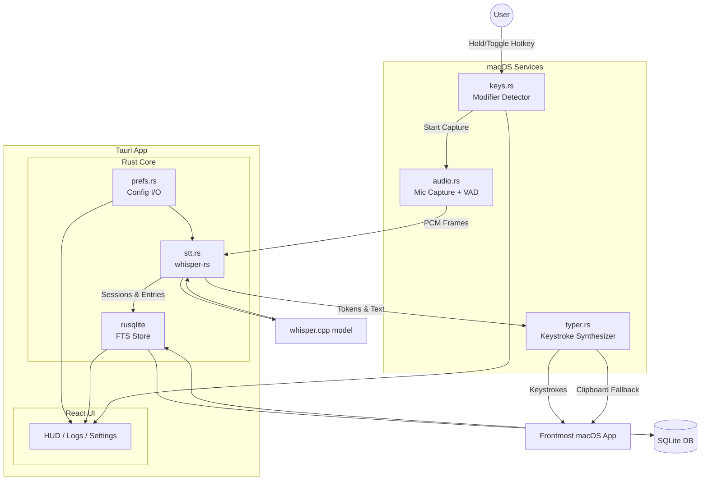
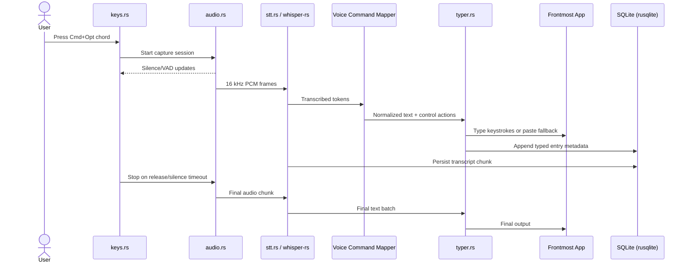

# Private STT

Small, secure, no-network, system-wide push‑to‑talk speech‑to‑text that types keystrokes in any app (including Cursor). Built with Tauri (TypeScript UI + Rust core) and whisper.cpp via whisper‑rs. All processing on-device; no sockets; no external services.

## Security & Privacy Posture (No Network)

- No HTTP clients, servers, sockets, or telemetry. CSP `connect-src 'none'`.
- Only macOS permissions: Microphone + Accessibility (to type).
- Model files are user-supplied and verified by local SHA‑256. No auto-download.
- SQLite database stored locally; no cloud sync by default.
- Tauri allowlist: disable shell and HTTP; restrict filesystem to app data dir.
- Logs searchable locally; explicit user-driven export to .txt/.md only.
 UX & Defaults
- Activation: dual
  - Hold‑to‑talk (default): press and hold Left Cmd+Left Option or Right Cmd+Right Option; release to transcribe and type.
  - Toggle: press once to start, auto-stop after 3s silence; press again to stop.
- Output: types keystrokes (natural insertion). No newline by default so you can write paragraphs.
- Voice commands: enabled by default (configurable)
  - “newline” → Enter; “new paragraph” → Enter+Enter; “tab” → Tab
  - “period/comma/colon/semicolon” → punctuation
  - “open quote/close quote”, “backtick”, “code block” (``` triplet)
- Record mode (long‑form): continuous multi‑hour capture/transcribe to file and DB (not typed into apps), chunked every 60s; defaults: 8h or 4GB per file with rotation.
 Models & Languages (coding-centric)
- Profiles (local-only models, verified by SHA‑256):
  - english-only-small.en (fastest; no translation)
  - multilingual-small (default; auto language, translate→English)
  - multilingual-medium (higher accuracy; slower)
- For Spanish/Portuguese/Mandarin input with English output: start with multilingual-small + translate; upgrade to medium if needed.

## Architecture

- Tauri app: React UI (TanStack Router) + Rust core
- Whisper engine: whisper‑rs (Metal offload on Apple Silicon)
- Audio capture: cpal → resample to 16 kHz mono
- Typing: enigo (CGEvents) with clipboard+paste fallback for secure fields
- Persistence: rusqlite (SQLite) with FTS5 for search
- No network code anywhere



## Directory Structure

stt/                         # Turborepo monorepo
├── apps/
│   └── web/                 # React UI (TanStack Router)
│       ├── src/
│       │   ├── main.tsx
│       │   ├── routes/     # /, /logs, /settings, /record
│       │   ├── components/ # LogTable, ExportDialog, HUD
│       │   └── lib/        # client utils (formatters)
│       ├── src-tauri/
│       │   ├── src/
│       │   │   ├── main.rs # tauri entry; commands wiring
│       │   │   └── lib.rs  # module declarations
│       │   ├── Cargo.toml
│       │   └── tauri.conf.json
│       └── package.json
├── packages/
│   ├── config/              # shared config types/utilities
│   └── env/                 # environment variables/types
├── .gitignore
├── package.json
├── tsconfig.json
├── turbo.json
└── biome.json

## Data Storage (SQLite)

- File: `~/Library/Application Support/sst/sst.db`
- Tables:
  - `sessions` (one per activation/recording)
    - `id TEXT PRIMARY KEY`, `mode TEXT` ('hold'|'toggle'|'record')
    - `started_at INTEGER`, `ended_at INTEGER NULL`
    - `language TEXT NULL`, `model_profile TEXT`, `translated INTEGER`
    - `app_name TEXT NULL` (frontmost app at time of typing; best-effort)
    - `chars_count INTEGER DEFAULT 0`, `words_count INTEGER DEFAULT 0`
  - `entries` (typed or recorded chunks)
    - `id TEXT PRIMARY KEY`, `session_id TEXT REFERENCES sessions(id)`
    - `started_at INTEGER`, `ended_at INTEGER`
    - `text TEXT NOT NULL`, `source TEXT` ('hold'|'toggle'|'record')
    - `typed INTEGER` (1 if typed into an app; 0 if only saved)
  - `entry_search` (FTS5 virtual table with content=entries, content_rowid=id)
- Indices on timestamps and session_id.
- Migrations embedded in Rust as SQL strings; applied on startup.

## UI (React + TanStack Router)

- Router: `@tanstack/react-router`
- Pages
  - `/` HUD/status: current mode, mic level, model profile
  - `/logs`: searchable table (TanStack Table) of sessions/entries with filters (date, mode, app, text)
    - Click a session to view timeline and entries
    - Select one/many entries and Export (.txt/.md)
  - `/settings`: hotkeys, mode defaults, silence seconds, model profile, voice commands map, typing behavior
  - `/record`: start/stop long-form record, show rolling transcript and file rotation
- Exports:
  - `.txt`: plain concatenation with timestamps (optional)
  - `.md`: headings for sessions; timestamps as blockquotes or inline; optional code block mapping

## Hotkeys (Modifiers‑Only; L/R aware)

- Default: Left Cmd + Left Option OR Right Cmd + Right Option
- Implementation: low-level event tap via `rdev` (left/right aware)
- Hold mode: start on both modifiers down; stop on release; defer typing until modifiers fully released.
- Toggle mode: start on keydown chord; auto-stop after 3.0s silence (RMS threshold configurable); or on next chord.

## Audio Capture & Silence (VAD-lite)

- `cpal` capture at device rate; resample to 16 kHz mono (e.g., `dasp`/`rubato`)
- Silence detector: short-window RMS below threshold for N seconds → stop (toggle mode)
- Chunking: buffers limited to avoid RAM spikes; write temp PCM/WAV as needed

## Whisper Integration

- `whisper-rs` with Metal when supported; else CPU fallback
- Load model once per profile; reuse context for speed
- Params:
  - threads = logical cores; `no_timestamps=true`
  - english-only profile: `language="en"`, `translate=false`
  - multilingual: `language=auto`, `translate=true` (default)
  - `suppress_non_speech_tokens=true`
- Post-processing:
  - Normalize whitespace; ASCII punctuation; configurable smart quotes off
  - Voice command mapping (on/off)

## Typing Output

- `enigo` keystrokes; ensure modifiers released; optional throttle per char
- Secure input fallback: if typing fails or secure input suspected, copy to clipboard → Cmd+V → restore clipboard (best-effort)
- Option: append newline (default off)

## Typical Workflow Sequence



## Preferences & Files

- Defaults tracked: `packages/config` (or runtime defaults embedded)
- Runtime prefs: `~/Library/Application Support/sst/config.json`
  - `hotkeys: { leftChord: true, rightChord: true }`
  - `mode: 'hold' | 'toggle'`
  - `silenceSeconds: 3.0`, `silenceRms: 'medium'`
  - `modelProfile: 'multilingual-small' | 'small.en' | 'multilingual-medium'`
  - `translateToEnglish: true`
  - `typing: { newlineAtEnd: false, throttleMs: 0 }`
  - `voiceCommands: { enabled: true, map: {...} }`
  - `record: { chunkSeconds: 60, maxHours: 8, maxFileGB: 4 }`
- Models dir: `~/Library/Application Support/sst/models/`
  - On first run: if model missing, show expected filename + SHA‑256; provide “Verify file” button to compute and compare locally.

## Permissions & Safety

- macOS: Microphone (first capture), Accessibility (first type)
- Optional: “Mute in password fields” toggle (best-effort heuristic)
- Tray quick toggle to disable typing globally if something looks like a password field

## Packaging

- Build: `tauri build` → macOS .app
- Optional later: codesign & notarize for smooth Gatekeeper

## Dependencies

- Rust (core):
  - `tauri` (v2), `tauri-plugin-single-instance`, `tauri-plugin-autostart`
  - `rdev` (global low-level key events), `cpal`, `dasp`/`rubato` (resample)
  - `whisper-rs` (Metal feature), `enigo`
  - `rusqlite` (+ `bundled` if needed), `serde`, `serde_json`, `anyhow`, `thiserror`, `parking_lot`
- TypeScript (UI):
  - `react`, `react-dom`, `@tanstack/react-router`, `@tanstack/react-table`
  - Minimal UI lib (or none); keep bundle lean

## Tauri Configuration (Hardening)

- Allowlist:
  - Disable: shell, http, process
  - FS: allow only app data dir and explicit export save dialog
- CSP: `default-src 'self'; connect-src 'none'; img-src 'self'; style-src 'self' 'unsafe-inline';`
- macOS category: Productivity
- Entitlements: microphone, accessibility; no network

## Implementation Tasks (MVP)

1) Bootstrap Tauri v2 app (React + TanStack Router); tray + settings window; CSP and allowlist locked down
2) Rust: prefs.rs (load/save), main.rs (commands + plugin init)
3) Rust: db.rs (SQLite migrations; CRUD; FTS5)
4) Rust: keys.rs (L/R modifiers-only capture; hold/toggle state machine; debounce)
5) Rust: audio.rs (cpal capture; resample; RMS silence detector)
6) Rust: stt.rs (model load with SHA‑256 verify; whisper-rs inference; profiles)
7) Rust: typer.rs (keystroke typing; clipboard fallback; release-modifier guard)
8) UI: /settings (hotkeys, profiles, silence, translate, typing, voice commands)
9) UI: /logs (TanStack Table; search; view session; select entries; export .txt/.md)
10) UI: / (HUD) and /record (long‑form session control)
11) Wire commands: start/stop capture, transcribe, insert typed text, read/write prefs, DB queries, export file dialog
12) Tests: unit (post-process; prefs; DB); manual QA across Terminal, Cursor, VS Code, Safari
13) Documentation: README (offline promise), SECURITY (permissions & model verification), SHA‑256 workflow

## Export Format Details

- .txt
  - Optional header: Session {id} — {start} → {end}, model: {profile}, translated: {bool}
  - Body: entries in chronological order (timestamps optional)
- .md
  - `# Session {id}` with metadata
  - `> [00:00:00–00:01:00]` before each chunk (optional)
  - Plain text, with code block mapping if voice commands were used

## Record Mode Bounds

- Defaults: `maxHours=8`, `maxFileGB=4`, `chunkSeconds=60`
- On reaching a bound: auto-rotate to a new file and new session row; no data loss
- Writes to DB and to rolling .txt file under App Support; never types into apps

## Current Repo State

The repo is initialized as a Turborepo monorepo with:
- `apps/web/` - Tauri + React app (src-tauri embedded)
- `packages/config/` - shared config package (placeholder)
- `packages/env/` - env types package

## After Push (Next Actions the Agent Can Implement)

- Add Rust module skeletons (keys.rs, audio.rs, stt.rs, typer.rs, prefs.rs, db.rs)
- Add SQLite migrations and FTS5 integration
- Implement defaults in packages/config (model checksums, default prefs)

## QA Checklist

- Hotkeys: both L/R combos; release-before-type guard
- Hold: capture→transcribe→type; no stray modifiers in text
- Toggle: 3.0s silence auto-stop works; adjustable threshold
- Voice commands mapping converts to keys/punctuation (toggleable)
- Logs: visible, searchable; can select entries; export .txt/.md
- Record mode: hours-long session rotates cleanly; no UI/hotkey interference
- No socket opens; CSP blocks connections; app functions offline
- Microphone + Accessibility prompts appear once then persist

## Notes on Performance

- small.en: lowest latency for English coding; best “snappiness”
- multilingual-small + translate: good for ES/PT/zh→EN; modest overhead
- multilingual-medium: upgrade only if accuracy issues appear
- Use context reuse and Metal offload for speed; avoid reloading models per session
