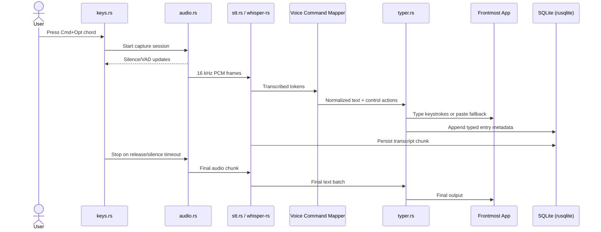
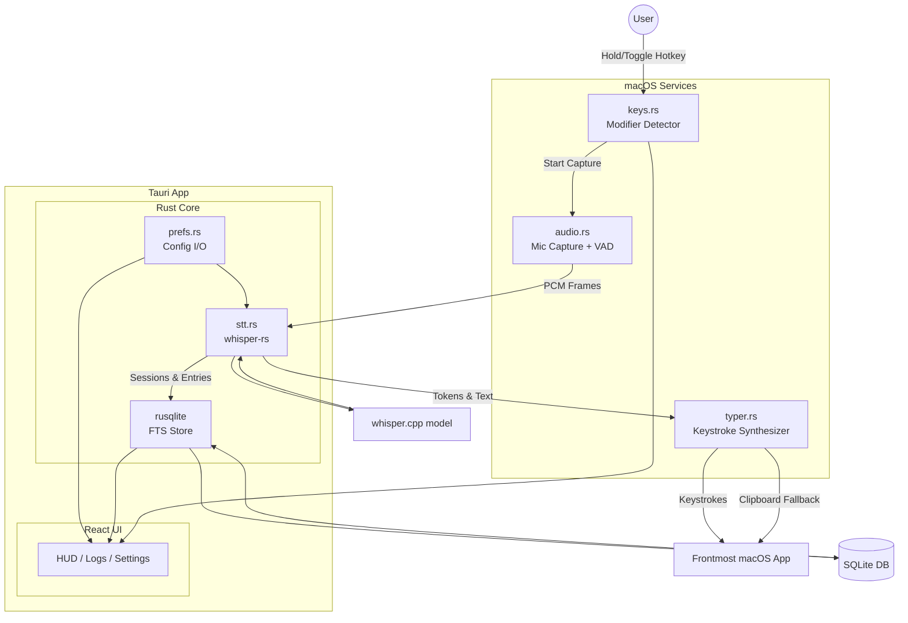

# stt

Offline push-to-talk speech-to-text for macOS that types directly into any app. Everything happens on-device: audio capture, transcription, and keystroke output. No network access, no telemetry, just private and fast dictation tailored for coding workflows.

## Project Goals

- Deliver a secure, privacy-first transcription assistant that never requires internet access.
- Provide smooth system-wide control with modifier-only hotkeys and optional long-form recording.
- Keep the app lightweight, transparent, and friendly to developers who live in terminals and editors.

## How It Works

- Hold or toggle a configurable key chord to start recording.
- Audio streams through a Rust pipeline that captures, normalizes, and feeds PCM frames to `whisper-rs`.
- Transcribed text is normalized, mapped for voice commands, and typed into the active macOS app (clipboard fallback for secure fields).
- Sessions and transcripts are stored locally in SQLite with full-text search for later review or export.

## Typical Workflow Sequence



## Stack Overview

- **Tauri v2** bridges a React UI with a Rust core while enforcing a no-network security posture.
- **Rust** modules handle hotkey detection, audio capture, whisper inference, keystroke synthesis, preferences, and local persistence.
- **SQLite (rusqlite + FTS5)** stores sessions, entries, and indexes for local search and export.
- **React + TanStack Router/Table** power the desktop UI for status, logs, settings, and long-form recording.
- **Whisper Models** are user-supplied GGML/GGUF files verified locally by SHA-256 before use.

## Architecture



## Development Notes

- The repository defaults to Metal-accelerated `whisper-rs` on Apple Silicon, with CPU fallback when necessary.
- All configuration lives in local JSON files and SQLite under `~/Library/Application Support/sst/`.
- The hardening checklist (CSP, Tauri allowlist, permissions) keeps the application fully offline.
- See `PLAN.md` for the detailed technical plan, directory structure, task list, and QA checklist.

## Current Status

This repo is in active development toward the MVP described in `PLAN.md`. Contributions should preserve the offline-only promise and keep dependencies lean. Use the plan as the source of truth for implementation details until a formal spec is published.

## Scaffolding

This project was created with [Better-T-Stack](https://github.com/AmanVarshney01/create-better-t-stack), a modern TypeScript stack that combines React, TanStack Router, and more.

## Features

- **TypeScript** - For type safety and improved developer experience
- **TanStack Router** - File-based routing with full type safety
- **TailwindCSS** - Utility-first CSS for rapid UI development
- **shadcn/ui** - Reusable UI components

## Getting Started

First, install the dependencies:

```bash
bun install
```

Then, run the development server:

```bash
bun run dev
```

Open [http://localhost:3001](http://localhost:3001) in your browser to see the web application.

## Directory Structure

```
stt/                         # Turborepo monorepo
├── apps/
│   └── web/                 # React UI (TanStack Router)
│       ├── src/
│       │   ├── main.tsx
│       │   ├── routes/     # /, /logs, /settings, /record
│       │   ├── components/ # LogTable, ExportDialog, HUD
│       │   └── lib/        # client utils (formatters)
│       ├── src-tauri/
│       │   ├── src/
│       │   │   ├── main.rs # tauri entry; commands wiring
│       │   │   └── lib.rs  # module declarations
│       │   ├── Cargo.toml
│       │   └── tauri.conf.json
│       └── package.json
├── packages/
│   ├── config/              # shared config types/utilities
│   └── env/                 # environment variables/types
├── .gitignore
├── package.json
├── tsconfig.json
├── turbo.json
└── biome.json
```

## Available Scripts

- `bun run dev`: Start all applications in development mode
- `bun run build`: Build all applications
- `bun run dev:web`: Start only the web application
- `bun run check-types`: Check TypeScript types across all apps
